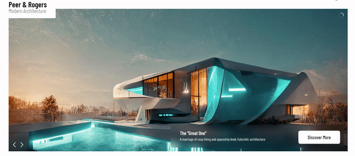
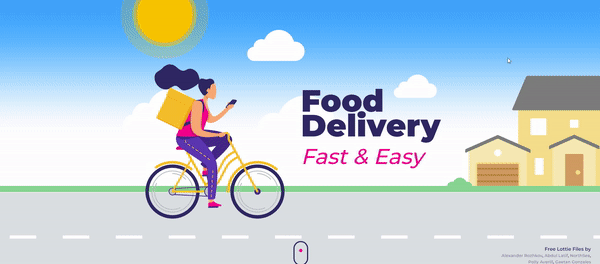
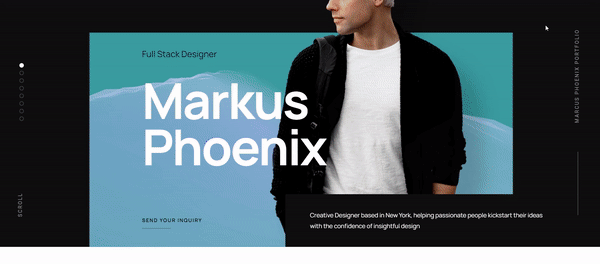
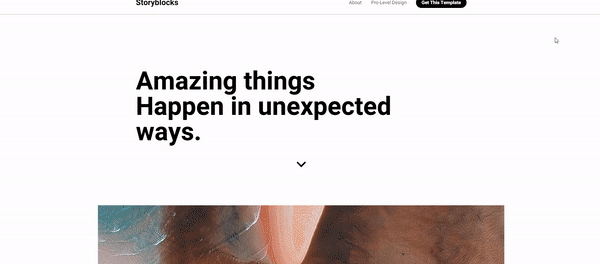
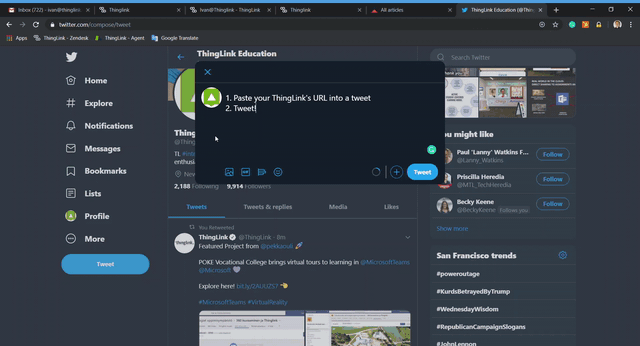

# Num Codes Portfolio

This project is my personal web development portfolio, designed to showcase my skills and past work to potential clients and recruiters. It's a clean, interactive space where you can get a quick sense of what I do and how I can help bring your digital ideas to life. Think of it as my online business card, but with more flair and all the details you'd need to know about my web development capabilities.

## Installation

Getting this portfolio up and running locally is super easy! Just follow these steps:

1.  **Clone the Repository**:
    ```bash
    git clone https://github.com/NumCodes/Portfolio-main.git # Assuming this is the repository URL
    ```
2.  **Navigate to the Project Directory**:
    ```bash
    cd Portfolio-main
    ```
3.  **Open `index.html`**:
    Since this is a static HTML project, you don't need any special server setup. Simply open the `index.html` file in your web browser. You can usually do this by double-clicking the file.

That's it! You're good to go.

## Usage

Once you've got the `index.html` file open in your browser, you can navigate through the different sections using the top menu: "Home", "About", "Skills", "Work", and "Contact".

*   **Home**: Get a quick introduction to who I am and what I do.
*   **About**: Learn more about my passion for web development and my approach to creating digital experiences.
*   **Skills**: See a breakdown of my professional skills and areas of expertise, complete with progress bars showing my proficiency.
*   **Work**: This is where the magic happens! Check out some of the projects I've worked on. Each image represents a project, and you can click on them (or hover for "View Site") to explore further.

Here are some examples of my work featured in the portfolio:

| Project Example 1 | Project Example 2 | Project Example 3 |
| :---------------- | :---------------- | :---------------- |
|  |  |  |

| Project Example 4 | Project Example 5 | Project Example 6 |
| :---------------- | :---------------- | :---------------- |
|  |  |  |

*   **Contact**: If you like what you see and want to chat about a potential project or just say hi, use the contact form to send me a message. There's also a "FAQs" section in the navigation menu for common questions.

## Features

*   **Clean, Responsive Design**: The portfolio looks great on any device, from desktops to mobile phones.
*   **Smooth Navigation**: Easy-to-use navigation allows for a seamless browsing experience through different sections.
*   **Dynamic Skill Showcase**: Visually appealing progress bars illustrate my proficiency in various professional skills.
*   **Project Gallery**: A dedicated section to display my previous work with interactive links.
*   **Interactive Contact Form**: A straightforward way for visitors to get in touch with me.
*   **Frequently Asked Questions (FAQs)**: A modal section addressing common inquiries about my services and processes.
*   **Social Media Integration**: Easy access to my professional social media profiles.
*   **Scroll-to-Top Button**: A convenient button to quickly return to the top of the page.

## Technologies Used

Here are some of the key technologies and tools that power this portfolio:

| Category | Technology | Description |
| :------- | :--------- | :---------- |
| **Frontend** | HTML5 | Structure and content of the web pages. |
| | CSS3 | Styling and visual presentation of the portfolio. |
| | JavaScript | Interactive elements and dynamic behavior. |
| | React | (Mentioned in FAQs) A JavaScript library for building user interfaces. |
| | Angular | (Mentioned in FAQs) A platform for building mobile and desktop web applications. |
| | Vue.js | (Mentioned in FAQs) A progressive framework for building user interfaces. |
| **Backend** | Node.js | (Mentioned in FAQs) A JavaScript runtime for server-side development. |
| | PHP | (Mentioned in FAQs) A popular general-purpose scripting language. |
| | Python | (Mentioned in FAQs) A versatile language used for web development, data science, and more. |
| **Databases** | MySQL | (Mentioned in FAQs) A popular open-source relational database. |
| | MongoDB | (Mentioned in FAQs) A leading NoSQL database. |
| | PostgreSQL | (Mentioned in FAQs) A powerful, open-source object-relational database system. |
| **E-commerce** | Shopify | (Mentioned in FAQs) A leading e-commerce platform. |
| | WooCommerce | (Mentioned in FAQs) An open-source e-commerce plugin for WordPress. |
| | Magento | (Mentioned in FAQs) An open-source e-commerce platform. |
| **Libraries/Tools** | Boxicons | A free collection of high-quality SVG icons. |
| | ScrollReveal.js | A JavaScript library for easily animating elements as they enter the viewport. |

## License

© Num Codes. All rights reserved.

## Author Info

Hi, I'm Num Codes, a passionate web developer focused on creating engaging and effective digital solutions.

*   **LinkedIn**: [Ugochukwu Nweze](https://www.linkedin.com/in/ugochukwu-nweze-08812a2b8)
*   **GitHub**: [NumCodes](https://github.com/NumCodes)
*   **X (Twitter)**: [@CodesNum80638](https://x.com/CodesNum80638)
*   **Instagram**: [num_codes](https://instagram.com/num_codes)

---

  
